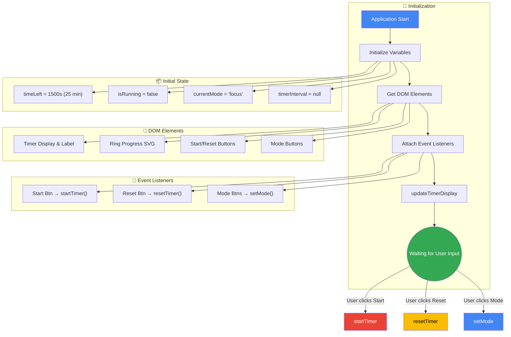
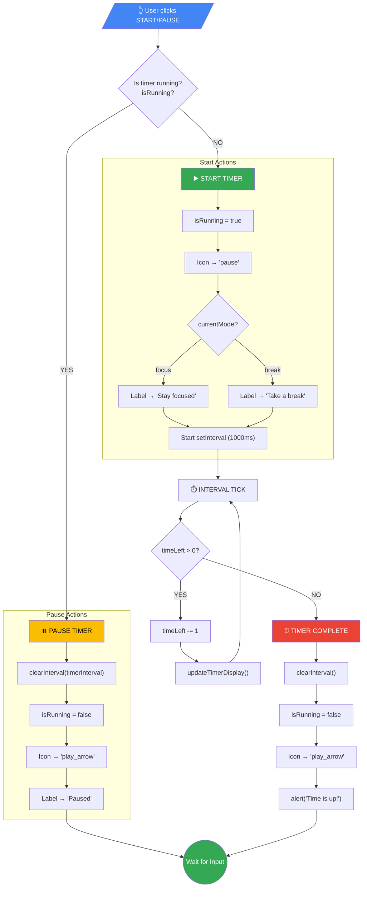
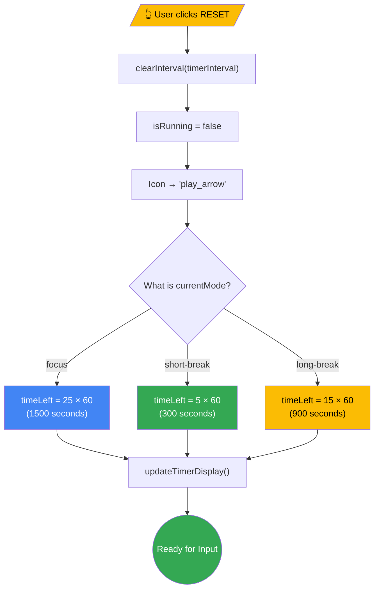
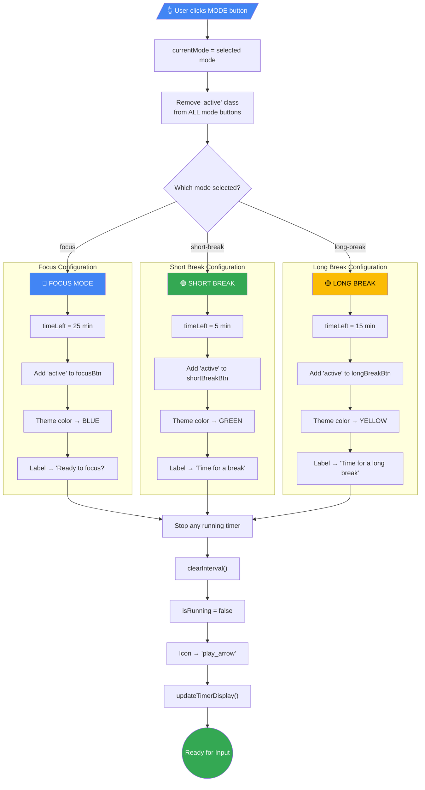
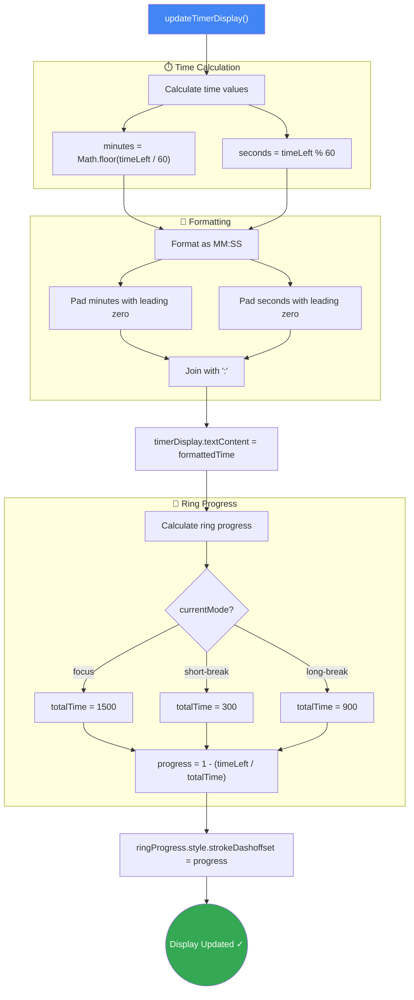
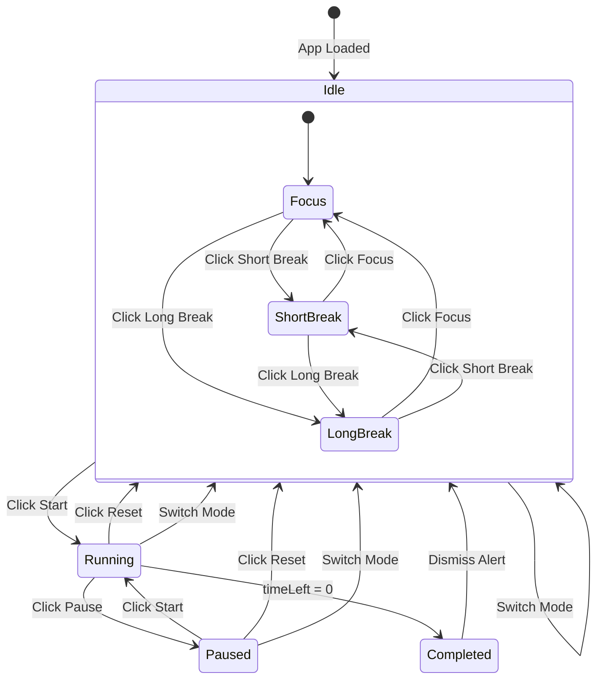
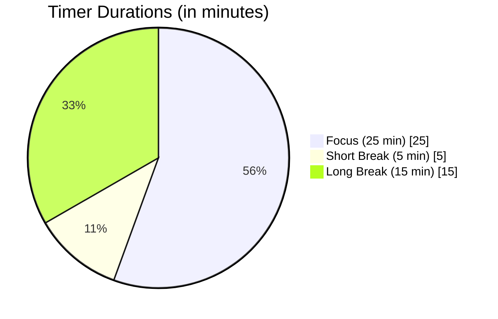
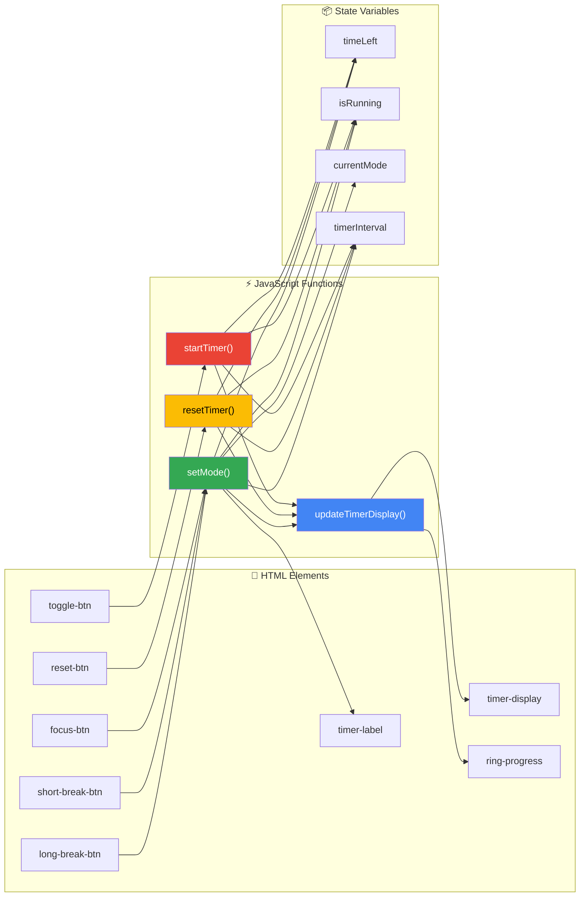

# 🍅 Pomodoro Timer Flowchart (Mermaid)

This document contains Mermaid flowcharts illustrating how the GDG Pomodoro Timer works.

---

## 📊 Complete Application Flow

---

## ▶️ Start/Pause Timer Flow

---

## 🔄 Reset Timer Flow

---

## 🎨 Switch Mode Flow

---

## ⏱️ Update Display Flow

---

## 🗺️ State Diagram

---

## 📋 Mode Configuration Chart

---

## 🎯 Component Relationship

---

## 📊 Summary Table

| Mode | Duration | Color | CSS Variable | Label |
|------|----------|-------|--------------|-------|
| 🔵 Focus | 25 min | Blue | `--google-blue` | "Ready to focus?" |
| 🟢 Short Break | 5 min | Green | `--google-green` | "Time for a break" |
| 🟡 Long Break | 15 min | Yellow | `--google-yellow` | "Time for a long break" |

---

*Generated from the GDG Pomodoro Timer Live Project*

> 💡 **Tip**: View this file on GitHub or in a Mermaid-compatible Markdown viewer to see the rendered diagrams!
